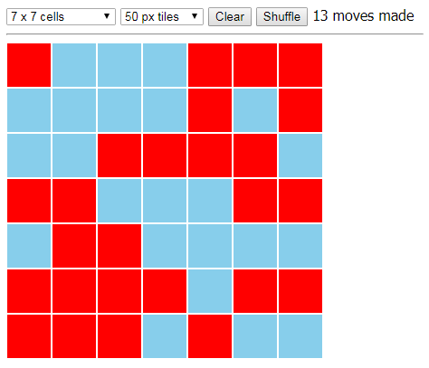

# FlipBoard

A (very) simple mathematical game to demonstrate the use of the **Knockout** library for creating dynamic JavaScript UIs.

Keywords:
- JavaScript, HTML, CSS
- Knockout, dynamic JavaScript UI
- MVVM pattern, separation between data and view components
- observable variables
- declarative bindings

## The Game

*FlipBoard* is a one-player board game played on a bicolored N&times;N square grid.
Clicking a square inverts the colors of all squares in the same row and the same column.
Your mission, should you decide to accept it, is to flip all cells to a red state!



The game itself is more like a mathematical game and quite boring to play.
But it has some interesting characteristics:
- Start with a cleared board.
If the layout is an *odd* number, you just have to click each square in the top row in an arbitrary order to win.
If the layout is an *even* number, you just have to click each square on the board in an arbitrary order to win.
- Start with a shuffled board.
If the layout is an *odd* number, you just have to click each *cleared* square from the starting configuration in an arbitrary order to win.

## Overview

The example provides three files:
- *flipboard.js* - the view model
- *flipboard.html* - the view
- *flipboard.css* - the stylings

The ```FlipBoard``` class implements the view model.
It holds the UI's underlying data and behaviours:

```js
function FlipBoard() {
  ...
  me.moves = ko.observable();
  me.cells = ko.observableArray([]);
  me.boardSize = ko.pureComputed(...);
  me.onMove = function ...
  ...
}
```

When the DOM is fully loaded, the view model is going to be bounded to the page:

```js
  var vm = new FlipBoard();
  ko.applyBindings(vm);
```

The game board is rendered using the ```foreach``` binding:

```html
  <div id="flipboard" data-bind="style: { width: boardSize, height: boardSize }">
    <div data-bind="foreach: cells">
      <button data-bind="click: $parent.onMove($index()), ..."></button>
    </div>
  </div>
```

## Links
- [**Knockout** on GitHub](https://github.com/knockout/knockout)
- [**Knockout**-Website](http://knockoutjs.com/)
